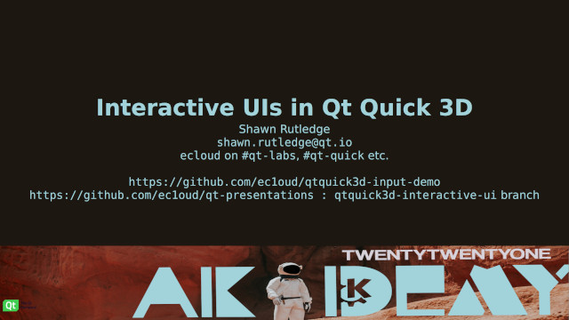

This is a repository of various Qt-related presentations given as talks at
various conferences.  It depends on 
[https://github.com/ec1oud/qml-presentation-system](https://github.com/ec1oud/qml-presentation-system)
which is a fork of 
[http://code.qt.io/cgit/qt-labs/qml-presentation-system.git/](http://code.qt.io/cgit/qt-labs/qml-presentation-system.git/)

On this **qtquick3d-interactive-ui** branch, the talk was originally given at 
[Akademy 2021](https://conf.kde.org/event/1/contributions/46/).

# Requirements

* Qt 6.2
  * qtbase, qtdeclarative, qtquick3d

# Running

Install the QML Presentation System.

Then `cd presentation; qml main.qml` or `qml main.qml -- 3` to start on slide 3,
for example.

