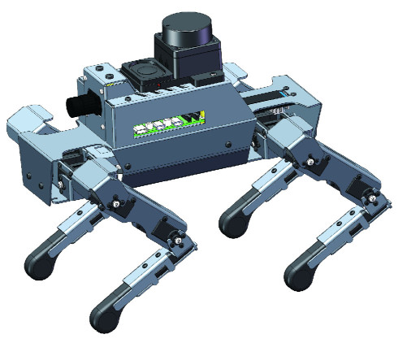

## Qt ROS presentation

This talk was first given at 
[NDC TechTown](https://ndctechtown.com/agenda/introduction-to-qt-robotics-0kof/065qiaqtf0x)
2026, including a demo with a 
[Dogzilla S2](https://web.archive.org/web/20250428151959/https://category.yahboom.net/products/dogzilla-s1?variant=46390953607484)
robot, demonstrating a daemon to run on the robot's Raspberry Pi 5, and a
digital twin for a PC, both built with QML and the new 
[Qt ROS](https://github.com/TheQtCompanyRnD/qtros) experimental module.  See
the [API docs](https://doc-snapshots.qt.io/qtros2/qtros2-getting-started.html)
to see how to do similar things in your project.

The qml slides here only depend on Qt (the qml tool should be in your path for
convenience), plus optionally the [gq](https://github.com/ec1oud/guanaquito)
submodule (only for syntax highlighting on the slides showing QML code).

```
$ qml -I gq  Slides.qml
```


