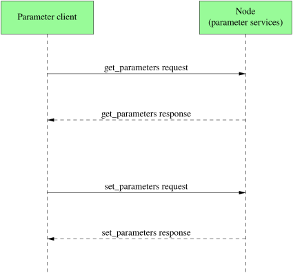

# Parameter

- configuration values stored per node, settable at startup or at runtime
- get/set through built-in services on the node: e.g. `get_parameters`, `set_parameters`
- synchronous request/response, same protocol as a regular service
- typed: bool, int64, float64, string, byte[] and array variants



```
$ ros2 param list
$ ros2 param describe /dogzilla/dogzillad motors.engaged
$ ros2 param get /dogzilla/dogzillad audio.mic
$ ros2 param set /dogzilla/dogzillad audio.master 0.8
```
