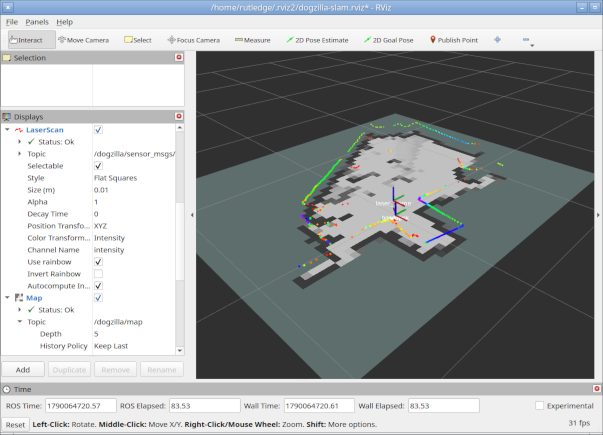

# Standard ROS utilities

- developer tools & visualization
  + RViz: 3D visualizer for robot, environment, LiDAR, planned paths
  + Gazebo: 3D simulator with physics
  + Foxglove Studio / RQt: older UI frameworks
- data logging: rosbag2
  + record and play back data
  + debug real-world sensor logs offline
- Python build tools
  + colcon: script to orchestrate building multiple packages
  + ament: enhancement for CMake/Python that defines how ROS packages are
    structured and discovered
  + EmPy: IDL to custom C++

