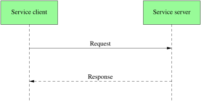

# Service

- synchronous request/response: e.g. a query
- service definitions originate from .srv files
- one-to-one
- return response



```
$ ros2 service list
$ ros2 service call /dogzilla/speech/stop std_srvs/srv/Trigger1
```
