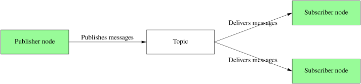

# Topic

- pub/sub for continuous data streams: sensor data, status, ...
- topic definitions originate from .msg files
- asynchronous, one-way communication
- multiple publishers and subscribers



```
$ ros2 topic list
$ ros2 topic echo /dogzilla/joint_states
$ ros2 topic bw /dogzilla/joint_states
...
```
